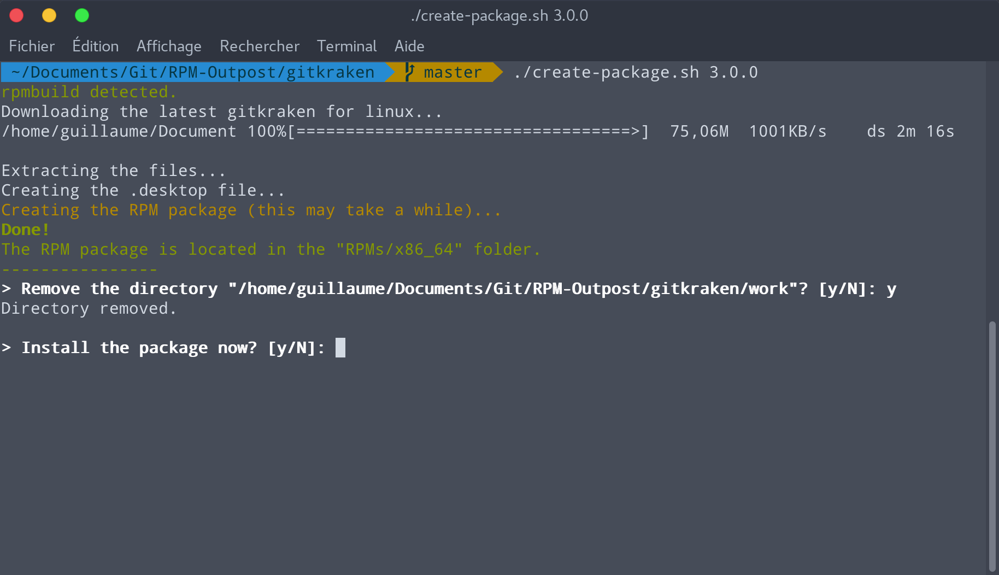
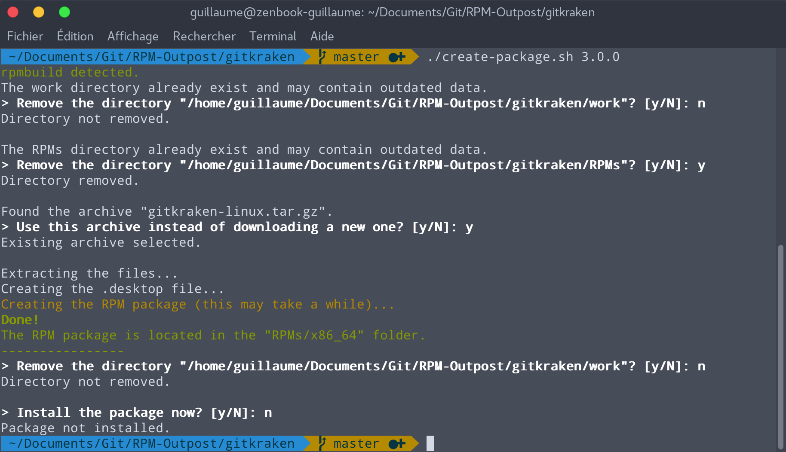

# RPM Package for Gitkraken
A script to create an RPM package of Gitkraken.

## How to use
1. Run the [create-package.sh](https://github.com/RPM-Outpost/gitkraken/blob/master/create-package.sh) script from the command line. It will download the latest version of Gitkraken and build an RPM package. You must specify the version of gitkraken, for instance: `./create-package.sh 3.0`
2. Then, install the package with `sudo dnf install <rpm file>`. The script can also install the package for you.

### Requirements
You need to install the `rpmdevtools` package to build RPM packages and use the script.
Don't worry: the script detects if it isn't installed, and can install it for you.

### About the version parameter
The script doesn't detect the latest version of gitkraken, so you have to specify it. I haven't found a way to download a specific gitkraken version, so the script always download the latest version, even if you specified an old version number.

### About root privileges
Building an RPM package with root privileges is dangerous, because a mistake in SPEC file could result in running nasty commands.
See http://serverfault.com/questions/10027/why-is-it-bad-to-build-rpms-as-root.

## Update Gitkraken
When a new version of Gitkraken is released, you can run the `create-package.sh [version]` script again to create an updated package.
Then install the updated package with `sudo dnf install <rpm file>`.

## Supported distributions
- Fedora 25
- Fedora 26

It probably work on other RPM-based distros but I haven't tested it. Let me know if it works for you!

## Screenshots

